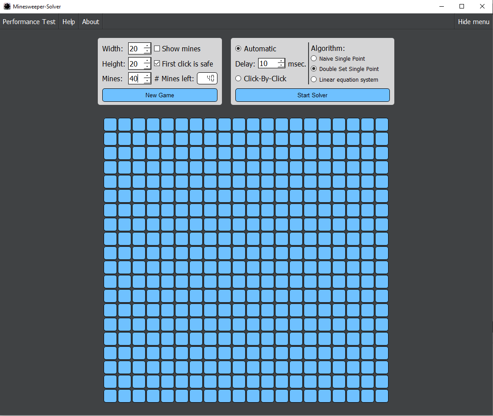
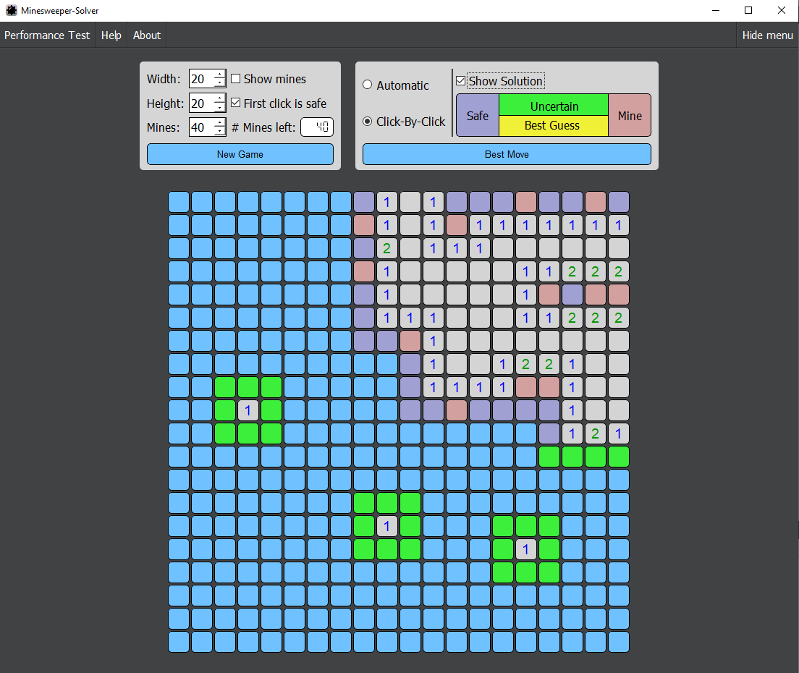
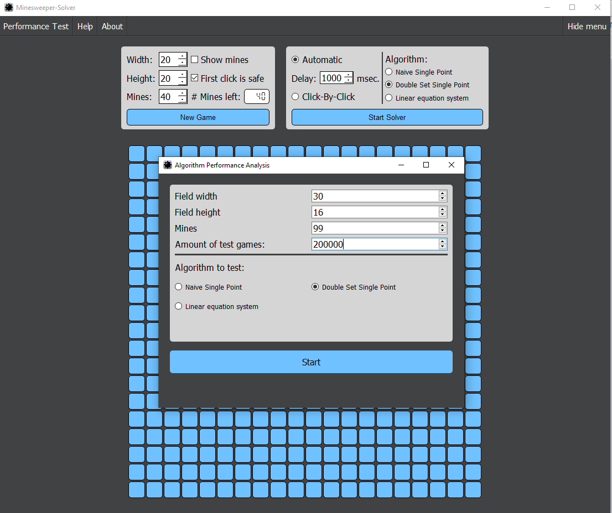
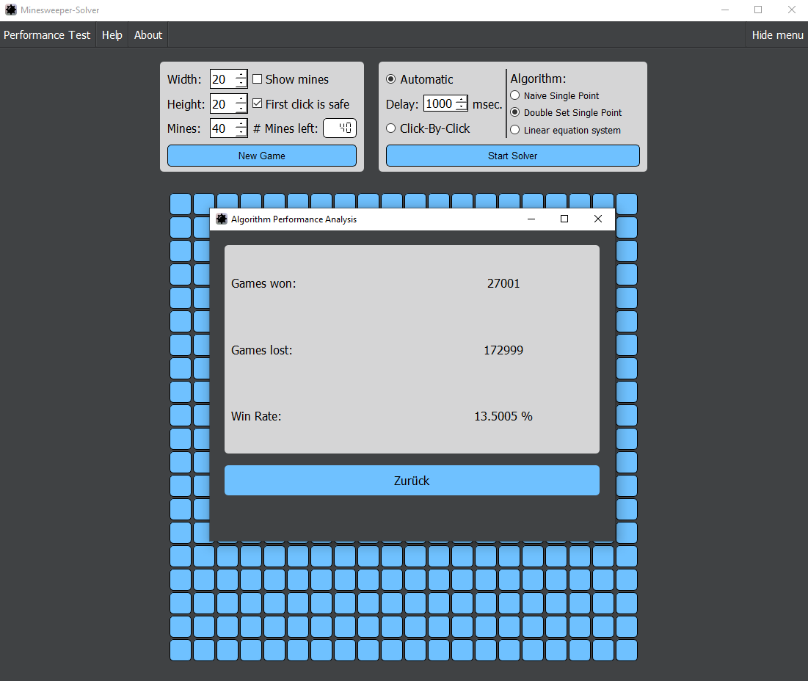

# Minesweeper-Solver
Minesweeper Solver created with Qt. Implementing the Naiv Single Point and the Double Set Single Point Algorithm. Linear Equation System and Best Guess not implemented yet...

